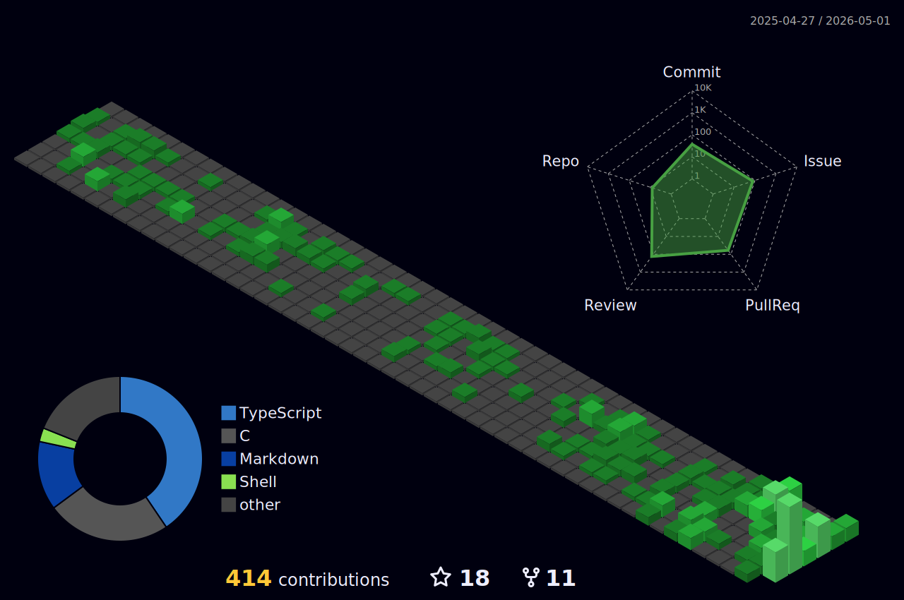

<h1 align="center">Hi there, I'm Hyung-Gyu Ryoo 👋</h1>

  <em>Database kernel developer at CUBRID · Spatial data nerd · Building things that store, search, and reason over data.</em>

  
  
  
  
  
  
  

  
  
  
  
  
  
  
  

---

### 🧑‍💻 About me

I'm a database kernel developer at **[CUBRID](https://github.com/CUBRID/cubrid)**, an open-source RDBMS, where I spend most of my time deep inside the storage and query engine. My academic roots are in **spatio-temporal databases and 3D GIS**, and I enjoy following how classic DBMS internals keep evolving as new workloads show up.

I like problems that sit at the intersection of:

- 🗄️ **DBMS internals** — storage, transactions, concurrency, query processing, indexing
- 🧭 **Geo-spatial intelligence** — 3D GIS, indoor space modeling, spatio-temporal data
- ⚙️ **Systems performance** — locking, parallelism, micro-architecture tuning, profiling
- 🌱 **Open-source software** — community-driven engineering, reproducible benchmarks

---

### 🎓 Background

- 🏢 **CUBRID** — Database kernel developer · contributor since CUBRID 11
- 🎓 **Pusan National University** — Integrated M.S./Ph.D. program in Spatio-Temporal Databases & GIS (2015–2018, *coursework completed, degree not conferred*)
- ✍️ Notes & write-ups on [hgryoo.dev](https://hgryoo.dev)

---

### 🧭 What I dig into

**Database internals**
Storage & buffer management · transactions, MVCC, locking · query processing · indexing (B-tree, multi-dimensional, ANN) · recovery & logging

**Concurrency & systems performance**
Multi-threaded engine design · lock contention analysis · CPU- and cache-level performance analysis · workload-driven micro-benchmarking

**Spatial & spatio-temporal data**
3D geometry processing · spatial indexing · indoor space modeling · OGC / IndoorGML standards

**Open-source DBMS engineering**
Build systems & dependency hygiene · regression test infrastructure · reproducible benchmarks · release & community workflow

**Software engineering culture & process**
Code review practices · branching & release strategies · developer experience inside long-lived C++ codebases · how teams sustain quality at scale

*Mostly C++/C in the engine, Java/Python around the edges, plenty of SQL.*

---

### 📌 Selected open-source projects

- **[CUBRID](https://github.com/CUBRID/cubrid)** — Open-source RDBMS built from the ground up in C/C++ — its own storage, transaction, and query layers, with built-in HA for production OLTP workloads.

---

### 🌳 Contribution garden

  

---

  <em>"Databases are just a very opinionated way of agreeing on the truth."</em>

